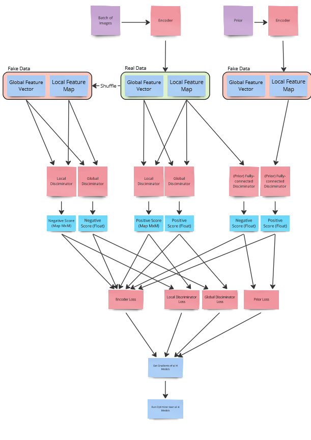

# dim_implementation_informationstheoretische_grundlagen_ws_22_24

Tensorflow implementaion of deep infomax

This was created for the _Seminar: Informationstheoretische Grundlagen von ML W22/23_ at FU Berlin

## What this is about

The basic idea of Deep Infomax (DIM) is to have a setup that allows you to combine multiple training goals.
This is combined with the idea of maximizing MI in order to do unsupervised learning as effectively as possible.

I have tried to recreate this approach in **Tensorflow**.

In doing so, I ran into some issues that made it very difficult to show my results within an ipynb file.
Therefore I have 4 different files.

## How the Files are structured

File 0\_ deals with training an encoder using the approach of DIM.

To evaluate if the results can be used, I built several classifiers that try to match the images of the mnist dataset to the correct numbers based on the features learned from the encoder.
In file 1* I build a simple classifier without my encoder.
I got the code for it from: [Tensorflow: writing training loop tutorial](https://www.tensorflow.org/guide/keras/writing_a_training_loop_from_scratch)
In file 2* I have adapted the code to run the images through the encoder before passing them through the same network.

In file 3\_ I present then briefly the data and refer to it.

## To run this on your own

I coded this on a Windows 10 machine with python **3.10.1**
You can install the requirements by executing `pip install -r ./requirements.txt`
To build multiple encoders, you need to re-run every cell, as I'm using `@tf.function` and was not able to find out how to reuse the function.

## About Sources:

I needed to learn tensorflow first, I used these tutorial very heavily in the beginning, and started from scratch later.

- [Install Tensorflow](https://www.tensorflow.org/install/pip)
- [Tensorflow: writing training loop tutorial](https://www.tensorflow.org/guide/keras/writing_a_training_loop_from_scratch)
- [Tensorflow: dcgan tutorial](https://www.tensorflow.org/tutorials/generative/dcgan)
- [Tensorflow: functional api tutorial](https://www.tensorflow.org/guide/keras/functional)
- [Tensorflow: save and load models](https://www.tensorflow.org/guide/keras/save_and_serialize)
- [Tensorflow docs: KLDivergence](https://www.tensorflow.org/api_docs/python/tf/keras/losses/KLDivergence)
- [Tensorflow docs: Math](https://www.tensorflow.org/api_docs/python/tf/math)

Also I used the Paper as a Resource and some follow up works

- [Learning deep representations by mutual information estimation and maximization](https://arxiv.org/abs/1808.06670)
- [Deep InfoMax: Learning good representations through mutual information maximization](https://www.microsoft.com/en-us/research/blog/deep-infomax-learning-good-representations-through-mutual-information-maximization/)
- [Jehill Parikh: Deep InfoMax Tensorflow-Keras Implementation](https://jehillparikh.medium.com/deep-info-max-tensorflow-keras-implementation-b1faeffb0260)

I marked every cell where copied code over

## The training

Each task has its own goal - but each decoder receives the same encoded sources.
Prioritization of tasks is done by specifying weights.
These are used by the encoder_loss function.

It would be easily possible to adapt each step here, and to add goals or even altering how them.
But for that also the encoder_loss function must be adapted.

Here a scetch of the train step:

